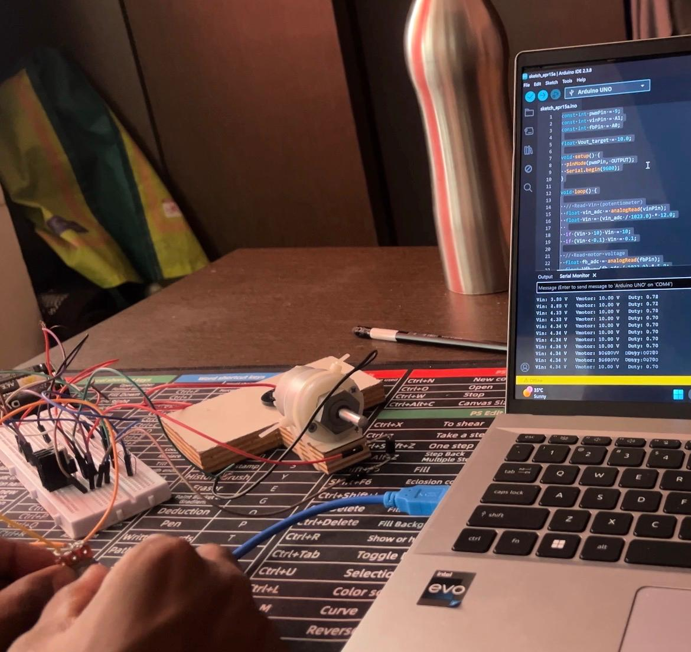
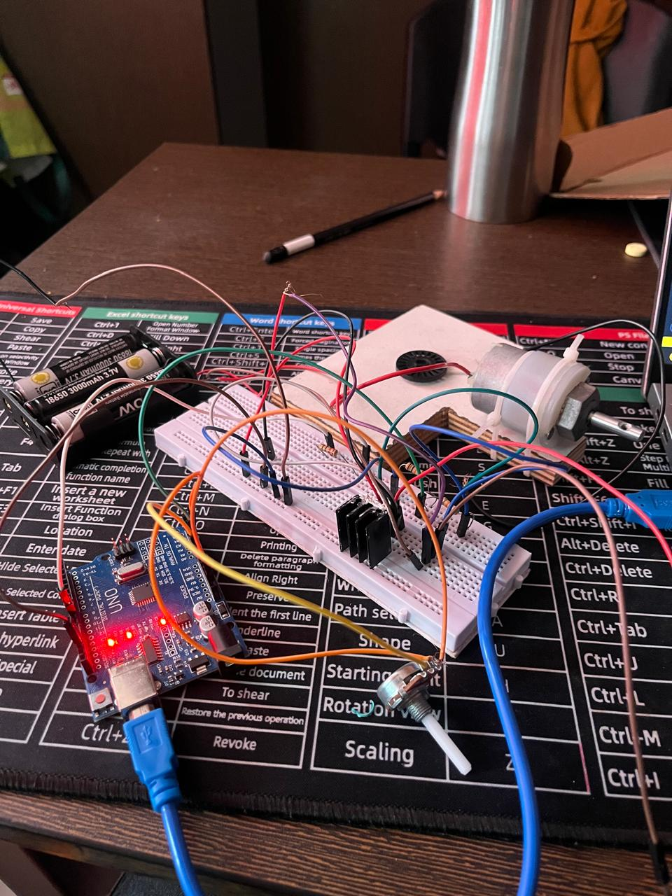

# Automatic Speed Control of DC Motor using Arduino

<p align="center">
  
</p>

<p align="center">
  <b>Closed-loop DC motor voltage/speed control using Arduino, PWM and MOSFET switching</b>
</p>

---

## 📌 Project Overview

This project implements an **automatic DC motor control system using Arduino and feedback**.

The system is designed to maintain approximately constant motor speed when the input supply voltage changes. A potentiometer is used to introduce input-voltage variation. The Arduino measures the input voltage and motor voltage, compares the measured motor voltage against a target value, and adjusts the PWM duty cycle applied to a MOSFET power stage.

The supplied project documentation describes the observed behavior:

- When input voltage decreases, PWM duty cycle increases.
- When input voltage increases, PWM duty cycle decreases.
- Motor voltage remains approximately constant.
- Motor speed remains approximately stable.

> **Control note:** This project uses motor-voltage feedback as an indirect method of speed regulation. It does **not** use an encoder for direct speed measurement.

---

## 🎯 Objectives

- Maintain approximately constant motor speed under varying input voltage.
- Implement a closed-loop feedback control system.
- Understand PWM-based voltage regulation.
- Interface Arduino with a MOSFET power stage.
- Simulate the control system using MATLAB Simulink.
- Observe the response of the system to input-voltage variation.

---

## ⚙️ System Architecture

```text
                 VARIABLE DC INPUT
                        │
                        ▼
              ┌───────────────────┐
              │  MOSFET POWER     │
              │      STAGE        │
              │    PWM CONTROL    │
              └─────────┬─────────┘
                        │
                        ▼
                  ┌───────────┐
                  │ DC MOTOR  │
                  └─────┬─────┘
                        │
                  Motor Voltage
                    Feedback
                        │
                        ▼
              ┌───────────────────┐
              │     ARDUINO       │
              │                   │
              │  ADC Measurement  │
              │        ↓          │
              │  Error Calculation│
              │        ↓          │
              │   PWM Adjustment  │
              └─────────┬─────────┘
                        │
                        └──────► MOSFET
```

---

## 🔄 Control Algorithm

The controller continuously executes the following sequence:

```text
1. Measure input voltage Vin
             ↓
2. Measure motor voltage Vmotor
             ↓
3. Compare Vmotor with target voltage
             ↓
4. Calculate control error
             ↓
5. If Vmotor is below target → increase PWM
             ↓
6. If Vmotor is above target → decrease PWM
             ↓
7. Apply PWM to MOSFET
             ↓
8. Repeat continuously
```

This is an incremental feedback control implementation based on the behavior documented in the supplied project report.

---

## 🧰 Hardware

The project documentation identifies the following major elements:

| Component | Function |
|---|---|
| Arduino UNO | Feedback controller |
| DC Motor | Controlled load |
| MOSFET | PWM switching element |
| Potentiometer | Simulates input-voltage variation |
| Voltage sensing circuit | Measures Vin and motor voltage |
| DC supply | Motor/power-stage supply |
| Breadboard & jumper wires | Prototype interconnection |

### Prototype Hardware

<p align="center">
  
</p>

The supplied photographs show the Arduino UNO, breadboard prototype, MOSFET/power-stage hardware, DC motor and the potentiometer used during the practical implementation.

---

## 💻 Software

### Arduino

The firmware is located at:

```text
arduino/automatic_speed_control/automatic_speed_control.ino
```

It performs:

- Analog voltage measurement
- ADC-to-voltage conversion
- Feedback error calculation
- PWM generation
- Continuous control updates
- Serial monitoring of Vin, motor voltage and PWM

### MATLAB / Simulink

The project documentation describes a Simulink model consisting of:

1. Reference speed block
2. Error detector
3. Controller
4. PWM generator
5. MOSFET switching circuit
6. DC motor model
7. Feedback path

The report states that the simulation was used to verify the control strategy and observe the transient response.

The repository contains:

```text
matlab/control_concept.m
```

This is a **control-concept MATLAB implementation**, not the original `.slx` model.

---

## 📁 Repository Structure

```text
automatic-dc-motor-speed-control/
│
├── README.md
├── .gitignore
│
├── arduino/
│   └── automatic_speed_control/
│       └── automatic_speed_control.ino
│
├── matlab/
│   └── control_concept.m
│
├── docs/
│   └── hardware_and_simulation_notes.md
│
└── images/
    ├── hardware_setup_01.jpg
    ├── hardware_setup_02.jpg
    └── README.txt
```

---

## 📊 Feedback Behavior

The documented demonstration reports the following response:

| Input condition | Controller response |
|---|---|
| Vin decreases | PWM duty cycle increases |
| Vin increases | PWM duty cycle decreases |
| Motor voltage | Remains approximately constant |
| Motor speed | Remains approximately stable |

The project report describes the resulting PWM response as smooth and the feedback operation as reliable.

---

## 📈 Simulation

The supplied documentation describes a MATLAB Simulink model used to test the control strategy before/alongside hardware implementation.

The model contains a feedback path from the motor to the controller and includes PWM generation and MOSFET switching.

The documented simulation results report:

- Stable output behavior.
- Smooth transient response.
- No sudden spikes in the observed response.
- Compensation for changes in the input condition.

---

## 🧪 Practical Prototype

The physical prototype was implemented on a breadboard using an Arduino UNO, DC motor, MOSFET switching stage, sensing connections and a potentiometer.

The project photographs included in this repository document the physical implementation.

---

## ⚠️ Important Implementation Note

The original uploaded documentation did **not** contain the original Arduino `.ino` source code or the original MATLAB Simulink `.slx` file.

Therefore:

- `automatic_speed_control.ino` is a **reconstructed implementation** of the documented control algorithm.
- `control_concept.m` is an **illustrative MATLAB control model** based on the documented approach.
- Exact original pin assignments, voltage-divider resistor values and original Simulink parameters should be verified against the actual hardware/model before use.

This distinction is intentionally documented so that the repository does not falsely claim that reconstructed files are the original project source.

---

## 🔌 Arduino Signal Configuration

The reconstructed firmware uses the following default mapping:

| Signal | Arduino pin |
|---|---|
| Input voltage sensing | A0 |
| Motor voltage sensing | A1 |
| PWM output | D9 |

These are configurable in the `.ino` file.

### Voltage sensing

The Arduino ADC must only receive a voltage within its permitted input range.

The firmware therefore assumes an appropriate voltage-divider/sensing circuit is used before connecting higher motor voltages to the ADC.

**Never connect a motor supply directly to an Arduino analog input.**

---

## 🚀 Future Improvements

The supplied project documentation proposes:

- PID-based control.
- Encoder-based direct speed measurement.
- LCD/IoT monitoring.
- Improved efficiency using DC-DC converters.

Additional engineering improvements could include:

- Motor current sensing.
- Over-current protection.
- Over-voltage protection.
- Thermal monitoring.
- Better MOSFET gate driving.
- Closed-loop RPM measurement.
- Data logging.
- Fault detection.

---

## 🧠 Skills Demonstrated

### Embedded Systems
- Arduino programming
- ADC acquisition
- PWM generation
- Real-time control loop

### Control Systems
- Feedback control
- Error calculation
- Closed-loop regulation
- Transient-response observation

### Power Electronics
- MOSFET switching
- PWM-based power control
- DC motor interfacing

### Simulation
- MATLAB
- Simulink
- Control-system modeling

### Hardware
- Breadboard prototyping
- Sensor interfacing
- Practical debugging
- Hardware/software integration

---

## 📌 Project Applications

The supplied documentation identifies potential applications in:

- Industrial motor drives
- Robotics
- Electric vehicles
- Fans and pumps
- Automation systems

---

## 👨‍💻 Portfolio

This project demonstrates the integration of **embedded programming + feedback control + power electronics + MATLAB/Simulink**, making it relevant to embedded systems, electrical engineering, motor control and automotive/motorsport applications.

---

## 📄 Documentation

Detailed project notes are available in:

```text
docs/hardware_and_simulation_notes.md
```

The original project report supplied for this repository describes the objectives, working principle, demonstration, results, limitations, future scope and Simulink model.
